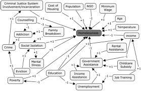
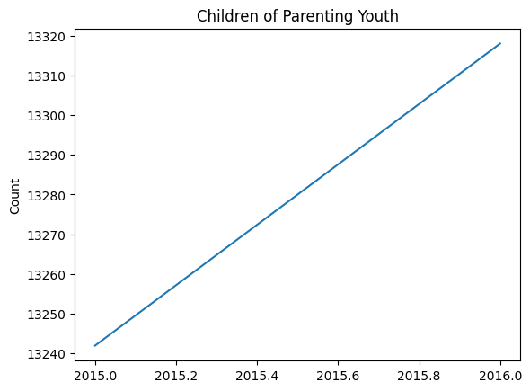
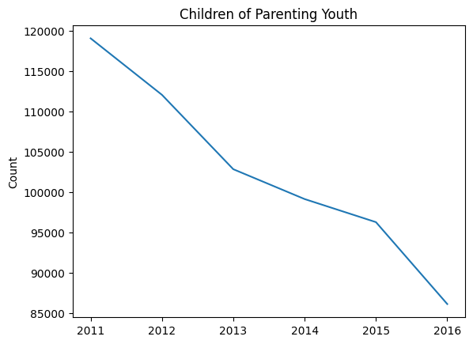

# Draft Proposal
# AI/ML and the Cost of Humanity in the homeless population

  Can AL/ML solve the problems of social economic ills? Well, given that we have one semester I do not think that the answer will be derived by the end of the summer. However, there can be experiments ran to provide some aspect of application to aid into contributing to the social economic outcomes to minimizes ills such as homeless population. Homelessness is a worldwide issue, and some commonalities can be found globally as an attribute to homelessness. According to the National Library of Medicine, homeless is define as an individual who lacks a fixed, regular, and adequate nighttime primary residence, lives in a publicly operated shelter to provide temporary living. (National Library of Medicine, June 2023) 
  The reason for homelessness varies and can be attributed to a mixture of social factors such as poverty, inadequate affordable housing, physical and mental health, addictions community and family breakdowns. (Mago, Vijay K, Aug ,2013). There are a few key characteristics statistically captured in 2023 such as 1.6 billion people live in inadequate housing and 582,462 individuals in America experiencing homelessness. Sixty percent of the homeless population lives in shelters and the other forty percent live in the street.  Some of the homeless populations are homeless with children. The age group of the homeless population falls in around an age of 25 and older. However, there are case where children are homeless as well, Unfortunately, the homeless population are vulnerable to hate crimes, lethal and non-lethal attack (Curls, Alexis, May 2023) However, other forms of common factors for homelessness are the Criminal Justice System, Income Assistance, poverty. and education. 
.

  
  

Figure 1. (National Library of Medicine, June 2023

Homeless in 2022

10 States with Highest Estimated Number of Homeless, 2022

Rank	State	Estimated Number of Homeless
- 1	California	171.521
- 2	New York	74.178
- 3	Florida	25.959
- 4	Washington	25.211
- 5	Texas	24.432
- 6	Oregon	17.959
- 7	Massachusetts	15.507
- 8	Arizona	13.553
- 9	Pennsylvania	12.691
- 10	Georgia	10.689
Figure 2. (Curls, Alexis, May 2023)

# Why is this issue important to you?
	From my understanding, most of the excitement in reference to AI/ML is geared around the potential to delivery to the global economic $13 trillion dollars including labor automation, innovation, and new competition. (Bughin, Jacques, Sept 2018). However, I wonder how AI/ML could solve social ills and can we use AI/ML in a matter to fix immigration, homelessness, and unequable equality that pledge our world. 
# What questions do you have in mind and would like to answer?
	Can we predict homelessness based off features that attributes to homeless?
	Does the current solutions to remedy homeless work?
		•	Rapid re-housing “Solutions.” Mar. 2019
		•	Delivering services, housing, and programs. (Solutions. Mar. 2019)
		•	Longer-term rental assistance and services “(Solutions. Mar. 2019)
		•	Crisis response system (Solutions. Mar. 2019)
		•	Reduce Criminal Justice Involvement (Solutions. June 2023.)
		•	Connections “Solutions.” June 2023. 
		•	Integrate Health Care (Solutions. June 2023.)
		•	Build Career Pathways (Solutions. June 2023.)
	If the solutions work how does the solution contributes to the community and economy to encourage continuous investment?
# Where do you get the data to analyze and help answer your questions (creditability of source, quality of data, size of data, attributes of data. etc.)?
	The data will have to be investigated to qualify as usefulness. However, to start the collection, the data to analyze will come from the US data census, Kaggle and another contributing site.

## Children of Parenting Youth rate is going up which is a indication that current solution is not working.
- There are a few features that have the same sentiment which indicate addtional investigation need to occur
 
	 
	 
	
## Chronically Homeless' and other attributes of homenesless 
- There are a few features that have the same sentiment as which Chronically Homeless  which indicates something is working

					# References
Bughin, Jacques, et al. “Notes from the AI Frontier: Modeling the Impact of AI on the World Economy.” McKinsey & Company, 4 Sept. 2018, www.mckinsey.com/featured-insights/artificial-intelligence/notes-from-the-ai-frontier-modeling-the-impact-of-ai-on-the-world-economy. 
Curls, Alexis. “National Homeless Facts and Statistics 2023.” Today’s Homeowner, 8 May 2023, todayshomeowner.com/general/guides/national-homeless-facts-and-statistics/#:~:text=Key%20Homelessness%20Statistics%20and%20Facts%20for%202023&text=In%20America%2C%20582%2C462%20individuals%20are,complete%20census%20conducted%20in%202020. 
Mago, Vijay K, et al. “Analyzing the Impact of Social Factors on Homelessness: A Fuzzy Cognitive Map Approach.” BMC Medical Informatics and Decision Making, 23 Aug. 2013, www.ncbi.nlm.nih.gov/pmc/articles/PMC3766254/. 
“National Library of Medicine - National Institutes of Health.” U.S. National Library of Medicine, www.nlm.nih.gov/. Accessed 3 June 2023. 
“Solutions.” National Alliance to End Homelessness, 5 Mar. 2019, endhomelessness.org/ending-homelessness/solutions/. 
“Solutions.” Solutions | United States Interagency Council on Homelessness (USICH), www.usich.gov/solutions/. Accessed 3 June 2023. 

